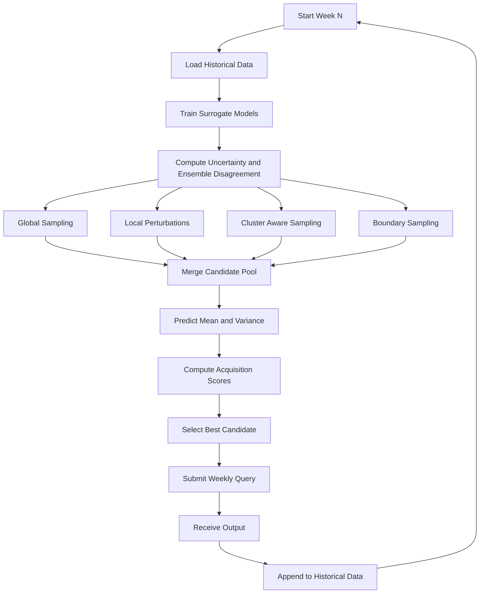

---

### **How the Weekly Query Loop Works**

Each optimisation round follows the same structured cycle:

1. **Load historical data**  
   All previous inputs and outputs are gathered to ensure the surrogate models always learn from the full search history.

2. **Train surrogate models**  
   Multiple models are fitted to approximate the unknown black‑box function. This gives a smoother, learnable representation of the landscape.

3. **Estimate uncertainty and disagreement**  
   The ensemble highlights where the models are confident, where they disagree, and where the function is still poorly understood.

4. **Generate candidate points**  
   Four complementary strategies explore different parts of the search space:  
   - *Global sampling* for broad exploration  
   - *Local perturbations* around promising regions  
   - *Cluster‑aware sampling* near high‑value areas  
   - *Boundary sampling* where uncertainty is high

5. **Merge all candidates**  
   The combined pool ensures both exploration and exploitation opportunities are considered.

6. **Score candidates**  
   Surrogate predictions (mean + variance) are used to compute acquisition scores such as Expected Improvement or uncertainty‑weighted metrics.

7. **Select the best point**  
   The candidate with the highest acquisition score becomes the official query for that week.

8. **Submit the query and receive the output**  
   The black‑box function returns a new value for the selected input.

9. **Update the dataset**  
   The new input–output pair is added to the history, completing the loop and preparing for the next week.
