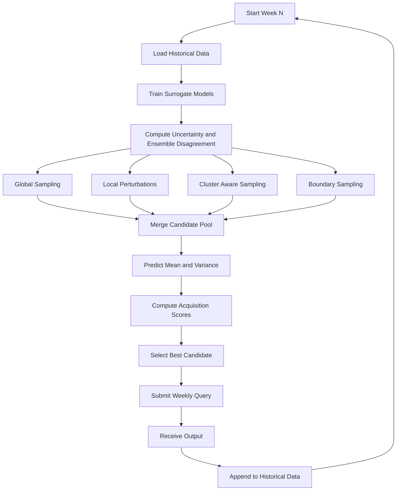

```mermaid
flowchart TD

    A[Start Week N] --> B[Load Historical Data]

    %% Surrogate Training
    B --> C[Train Surrogate Models]
    C --> D[Compute Uncertainty and Ensemble Disagreement]

    %% Candidate Generation
    D --> E1[Global Sampling]
    D --> E2[Local Perturbations]
    D --> E3[Cluster Aware Sampling]
    D --> E4[Boundary Sampling]

    %% Merge Candidates
    E1 --> F[Merge Candidate Pool]
    E2 --> F
    E3 --> F
    E4 --> F

    %% Scoring
    F --> G[Predict Mean and Variance]
    G --> H[Compute Acquisition Scores]

    %% Selection
    H --> I[Select Best Candidate]
    I --> J[Submit Weekly Query]

    %% Feedback Loop
    J --> K[Receive Output]
    K --> L[Append to Historical Data]
    L --> A
```