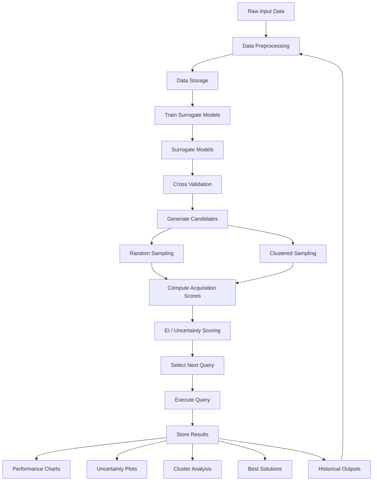

```mermaid
flowchart TD

    %% --- Data Layer ---
    A[Raw Input Data] --> C[Data Preprocessing]
    B[Historical Outputs] --> C
    C --> D[Data Storage]

    %% --- Surrogate Modelling ---
    D --> E[Train Surrogate Models]
    E --> F[Surrogate Models]
    F --> G[Cross Validation]

    %% --- Acquisition Engine ---
    G --> H[Generate Candidates]
    H --> I1[Random Sampling]
    H --> I2[Clustered Sampling]
    I1 --> J[Compute Acquisition Scores]
    I2 --> J
    J --> K[EI / Uncertainty Scoring]

    %% --- Query Selection ---
    K --> L[Select Next Query]
    L --> M[Execute Query]
    M --> N[Store Results]

    %% --- Visualisation ---
    N --> O[Performance Charts]
    N --> P[Uncertainty Plots]
    N --> Q[Cluster Analysis]
    N --> R[Best Solutions]

    %% --- Feedback Loop ---
    N --> B
    
```